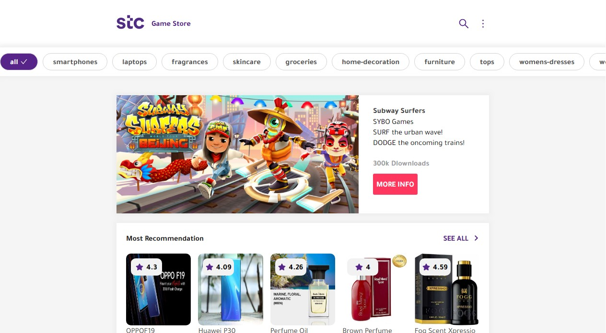

 

  

  <h1 align="center">STC - Game Store</h1>

  

    <a href="https://stc-game-store.vercel.app/">View Demo</a>
  

<!-- ABOUT THE PROJECT -->

## About The Project

 

STC - Game Store web application is a SPA to list all of the games details and the single game details
when clicked; with the following features:

- Fully responsive.
- The user can filter the products by category.
- Login client-side validation.
- Build a Redux-like state management using context API & useReducer.
- Loading & error page handling.
- And more...

(<a href="#readme-top">back to top</a>)

### Technologies ⚡

- 
-  (SCSS)
- 
- 

(<a href="#readme-top">back to top</a>)

